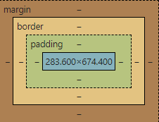

# FrontEnd-LinhaDeAprendizado
Linha de aprendizado Front-End

- `HTML e CSS`
## HTML, CSS e Javascript, quais as diferenças?

HTML: linguagem de marcação utilizada para estruturar os elementos da página, como parágrafos, links, títulos, tabelas, imagens e até vídeos.

CSS: linguagem de estilos utilizada para definir cores, fontes, tamanhos, posicionamento e qualquer outro valor estético para os elementos da página.

Javascript: linguagem de programação utilizada para deixar a página com mais movimento, podendo atualizar elementos dinamicamente e lidar melhor com dados enviados e recebidos na página.

### Estrutura Básica HTML

Para que um documento seja interpretado pelo navegador, é necessário que o arquivo tenha a extensão .html e a partir disso, poderá ser exibido por qualquer navegador web.

```
<!--Tag que precisa de fechamento-->
    <h1>Olá Mundo!</h1>
    <!--Tag de auto fechamento-->
    
```

- ` <!DOCTYPE html> ` Informa ao navegador que esse documento é do tipo HTML e sua versão. Quando está escrito apenas html, indica que é a mais recente.
- ` <html> ` Representa a raiz do documento, serve com um container que engloba todos os outros elementos HTML.
- ` <body> ` É onde fica todo o conteúdo de texto, imagem e vídeos, em que o usuário vê e interage, nele os conteúdos são estruturados pelas demais tags do HTML.
- ` <script> ` Esse elemento contém instruções de script ou aponta para um arquivo de script externo por meio do atributo src.
- ` <head> ` Compreende as informações do documento que serão interpretadas pelo navegador (metadados). Como por exemplo, título do documento, links para folhas de estilo etc.
- ` <meta> ` Define metadados, ou seja, informações sobre dados de um documento HTML.
- ` <link> ` Contém apenas atributos e faz a relação do documento HTML com recursos externos, é comumente usado para vincular uma folha de estilo externa.
- ` <style> ` Essa tag é usada para declarar estilos (CSS) para um documento.

Tags semânticas são tags que possuem um significado, que dão sentido a informação de texto ao navegador e buscadores, como por exemplo, utilizar a tag <header> para cabeçalhos ou <article> para dar um significado de artigo para aquele bloco de texto.


## [1-html-css](https://github.com/algabg1/FrontEnd-LinhaDeAprendizado/tree/main/1-html-css): ambientes de desenvolvimento, estrutura de arquivos e tags

## HTML e CSS: Classes, posicionamento e Flexbox

- `margin` (margem): o maior e mais externo retângulo, que está na cor laranja-claro.

- `border` (borda): está dentro do retângulo da margem, sendo proporcionalmente menor a ele, e é da cor amarelo claro.

- `padding` (espaçamento): retângulo verde-claro que está dentro do retângulo da borda, também proporcionalmente menor a ele. Área em torno do conteúdo.

- `conteúdo`: um retângulo azul-claro que está dentro do retângulo de espaçamento e é proporcionalmente menor que ele. Onde texto e imagens aparecem.



Se não são definidos, há um padrão que é criado automaticamente para a página.

### Flexbox CSS

Os filhos de um elemento com Flexbox podem se posicionar em qualquer direção e pode ter dimensões flexíveis para se adaptar.

```
  .flex-container {
    display: flex;
    flex-direction: row | row-reverse | column | column-reverse;
    flex-wrap: nowrap | wrap | wrap-reverse;
    flex-flow: row nowrap | row wrap | column nowrap | column wrap;
    justify-content: flex-start | flex-end | center | space-between | space-around | space-evenly;
    align-items: stretch | flex-start | flex-end | center | baseline;
    align-content: flex-start | flex-end | center | space-between | space-around | stretch;
    order: <número>; /* o valor padrão é 0 */
    flex-grow: <numero>; /* o valor default (padrão) é 0 */
    flex-shrink: <número>; /* o valor padrão é 0 */
    flex-basis: flex-basis:  | auto; /* o valor padrão é auto */
    flex: none | [ <'flex-grow'> <'flex-shrink'>? || <'flex-basis'> ]
    align-self: auto | flex-start | flex-end | center | baseline | stretch;
  }
```

Para que as propriedades funcionem nos elementos-filhos, as pais devem ter propriedade display: flex;.

## HTML e CSS: cabeçalho, footer e variáveis CSS

```
<head>
</head>

<body>
  <header>
    <nav>
    </nav>
  </header>

  <main>
    <section>
    </section>
  </main>

  <footer>
  </footer>

</body>
```

### Navegando entre páginas

```
    <header>
        <nav>
            <a href="index.html">Home</a>
            <a href="about.html">Sobre mim</a>
        </nav>
    </header>
```

### Utilizando :root

Definindo variáveis do projeto:

```
:root{
  --nome-cor: #cor;
  --nome-fonte: 'fonte';
}
```

Utilizando as variáveis:

```
body{
  background-color: var(--nome-cor);
  font-family: var(--nome-fonte);
}
```

## HTML e CSS: trabalhando com responsividade e publicação de projetos

### Unidades de medida

Comprimentos absolutos:
- `cm` (centímetros)
- `mm` (melímetros)
- `in` (inches/polegadas)
- `px` (pixels): o píxel do CSS NÃO é realmente um píxel da tela do dispositivo (hardware), e sim o que chamamos de píxel de referência que geralmente é maior do que o píxel real. O que acaba por torná-lo numa medida abstrata onde é necessário controlar o mapeamento desse píxel de referência para o píxel do hardware
- `pt` (points): geralmente espera-se que essa medida seja utilizada em folhas de estilo para impressões, quando se precisa ter certeza do tamanho da fonte utilizada. Não é recomendada para a estilização em tela
- `pc` (paica)

Comprimentos relativos:
- `em` (ems): muda para os elementos filhos de acordo com o tamanho da fonte (font-size) do elemento pai
- `rem` (rems, "root em"): o rem está relacionado com o tamanho da fonte do elemento root (raiz), no caso, a tag
- `%` (porcentagem)
- `ex` (x-height): essa unidade não se relaciona com o tamanho da fonte (font-size), mas com qual fonte está sendo utilizada naquele momento (font-family)
- `ch` (character unit)
- `vw` (viewport width): viewport nada mais é que a área visível de uma página web para o seu usuário, essa viewport pode variar de acordo com o dispositivo, sendo menor em celulares e maior em desktops. Essa unidade se relaciona diretamente com a largura da viewport, onde 1vw representa 1% do tamanho da largura dessa área visível
- `vh` (viewport height): funciona da mesma forma que o vw, porém dessa vez, a referência será a altura e não a largura
- `vmin/vm` (viewport minimun): utilizará como base a menor dimensão da viewport (altura x largura)
- `vmax` (viewport maximum): terá como valor de referência a maior dimensão da viewport

Site que verifica o suporte das medidas nos navegadores: [Can I Use](https://caniuse.com/?search=vw)

Conversão de valores para adaptar nos projetos: [nekoCalc](https://nekocalc.com/px-to-rem-converter)

### Usando Media Queries

[Documentação](https://developer.mozilla.org/pt-BR/docs/Web/CSS/CSS_media_queries/Using_media_queries)

```
@media (parâmetro) {
  configurações
}

@media (max-width: 1200px) {
    .cabecalho{
        padding: 10%;
    }

    .cabecalho-menu {
        justify-content: center;
    }

    .apresentacao{
        flex-direction: column-reverse;
    }

}
```

Podemos definir uma largura máxima de “480px” para o celular: `@media (max-width: 480px)`, e em outra media query definir uma largura máxima de “800px” para os tablets: `@media (max-width: 800px)`, e então atribuímos os ajustes necessários dentro de cada media query, dessa forma teremos nosso site 100% responsivo.

Podemos também definir intervalos para os tamanhos de telas com um único media query, atribuímos o valor mínimo e depois o valor máximo separando ele pelo atributo and, veja: `@media (min-width: 480px ) and (max-width: 800px)`, nesse caso os estilos serão aplicados em telas de no mínimo “480px” e de no máximo “800px”.

### [Srcset: Trabalhando com imagens responsivas](https://www.alura.com.br/artigos/srcset-trabalhando-imagens-responsivas)

Quando queremos utilizar imagens diferentes em situações diferentes, utilizamos a tag `<picture>` com as tags `<source>`. Neste caso temos maior controle de quando uma imagem é mostrada na página e quando temos imagens iguais com resoluções diferentes utilizamos a propriedade `srcset`.

## HTML e CSS: praticando HTML/CSS

## HTML e CSS: responsividade com mobile-first
